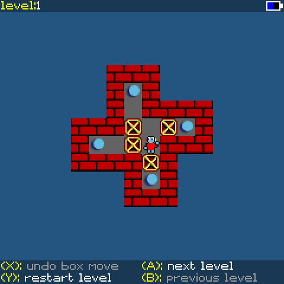

# PicoSystem Boxworld

A version of Boxworld or Sokoban for the [Pimoroni Picosystem](https://shop.pimoroni.com/products/picosystem?variant=32369546985555), written in C++ using the Picosystem SDK.

This version of Boxworld has the same 100 levels that are found in the Windows 3.1 version of Boxworld from 1992.

The aim of the game is to place all of the yellow boxes on the spaces with the yellow dots. Place boxes by pushing them using the purple robot. The boxes change colour to red when they are placed on the yellow dots. You can only push the boxes, they can't be pulled. The level is complete when all boxes are in place.

## Controls:-
- Move the robot via the D-pad.
- (A) move to the next level.
- (B) move to the previous level.
- (X) Undo the last box move. There is only one level of undo.
- (Y) restart the current level from the beginning.

## The first level:-



## Required to build:-
- PicoSystem SDK - https://github.com/pimoroni/picosystem
- Pico SDK - https://github.com/raspberrypi/pico-sdk/

## Build:-
```
    mkdir build
    cd build
    cmake ..
    make
```
